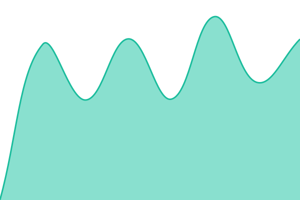

# [📈 Live Status](https://demo.upptime.js.org): <!--live status--> **🟧 Partial outage**

This repository contains the open-source uptime monitor and status page for [Kristián Kunc](https://kristn.co.uk), powered by [Upptime](https://github.com/upptime/upptime).

With [Upptime](https://upptime.js.org), you can get your own unlimited and free uptime monitor and status page, powered entirely by a GitHub repository. We use [Issues](https://github.com/kristiankunc/upptime/issues) as incident reports, [Actions](https://github.com/kristiankunc/upptime/actions) as uptime monitors, and [Pages](https://demo.upptime.js.org) for the status page.

<!--start: status pages-->
<!-- This summary is generated by Upptime (https://github.com/upptime/upptime) -->
<!-- Do not edit this manually, your changes will be overwritten -->
<!-- prettier-ignore -->
| URL | Status | History | Response Time | Uptime |
| --- | ------ | ------- | ------------- | ------ |
|  [VatNotif web](https://vatnotif.kristn.co.uk) | 🟩 Up | [vat-notif-web.yml](https://github.com/kristiankunc/upptime/commits/HEAD/history/vat-notif-web.yml) | 

 811ms
     
 | 

<a href="https://status.kristn.co.uk/history/vat-notif-web">100.00%</a>
    

|  [VatNotif API](https://vatnotif-api.kristn.co.uk) | 🟩 Up | [vat-notif-api.yml](https://github.com/kristiankunc/upptime/commits/HEAD/history/vat-notif-api.yml) | 

 683ms
     
 | 

<a href="https://status.kristn.co.uk/history/vat-notif-api">100.00%</a>
    

|  [Ratar TD game](https://td-game.kristn.co.uk) | 🟩 Up | [ratar-td-game.yml](https://github.com/kristiankunc/upptime/commits/HEAD/history/ratar-td-game.yml) | 

 524ms
     
 | 

<a href="https://status.kristn.co.uk/history/ratar-td-game">100.00%</a>
    

|  [Ratar TD web](https://td.kristn.co.uk) | 🟥 Down | [ratar-td-web.yml](https://github.com/kristiankunc/upptime/commits/HEAD/history/ratar-td-web.yml) | 

 493ms
     
 | 

<a href="https://status.kristn.co.uk/history/ratar-td-web">53.02%</a>
    

|  [Jellyfin](https://jellyfin.kristn.co.uk) | 🟩 Up | [jellyfin.yml](https://github.com/kristiankunc/upptime/commits/HEAD/history/jellyfin.yml) | 

 969ms
     
 | 

<a href="https://status.kristn.co.uk/history/jellyfin">100.00%</a>
    

|  [Seerr](https://seerr.kristn.co.uk/) | 🟩 Up | [seerr.yml](https://github.com/kristiankunc/upptime/commits/HEAD/history/seerr.yml) | 

 1432ms
     
 | 

<a href="https://status.kristn.co.uk/history/seerr">100.00%</a>
    

|  [MC map](https://mc-map.kristn.co.uk) | 🟥 Down | [mc-map.yml](https://github.com/kristiankunc/upptime/commits/HEAD/history/mc-map.yml) | 

 612ms
     
 | 

<a href="https://status.kristn.co.uk/history/mc-map">0.00%</a>
    

<!--end: status pages-->

[**Visit our status website →**](https://demo.upptime.js.org)

## 📄 License

- Powered by: [Upptime](https://github.com/upptime/upptime)
- Code: [MIT](./LICENSE) © [Anand Chowdhary](https://anandchowdhary.com), supported by [Pabio](https://pabio.com)
- Data in the `./history` directory: [Open Database License](https://opendatacommons.org/licenses/odbl/1-0/)
